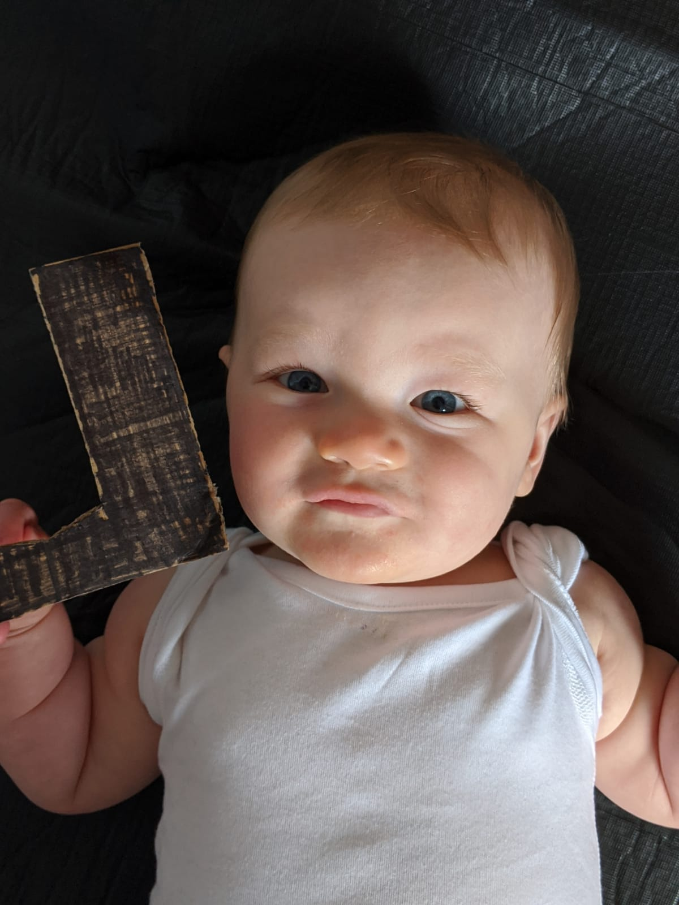

## Rules

- One point for the movie

  

## Question 1
<section>
	
    
</section>

## Question 2
</img>

## Question 3
</img>

## Question 4
</img>

## Question 5
</img>

## Question 6
</img>

## Question 7
</img>

## Question 8
</img>

